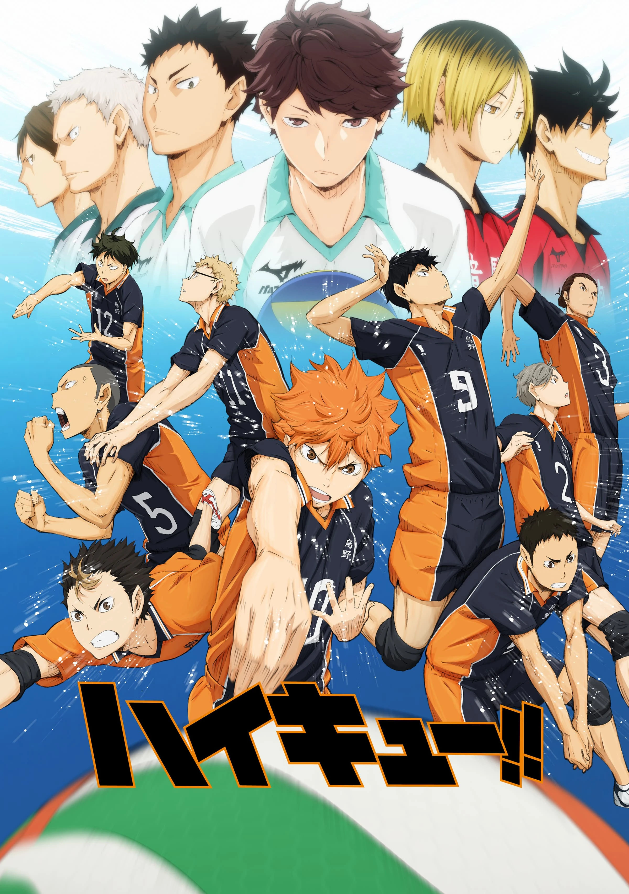

# Haikyu!! - Season 1

| |                             |
|--------------------|-----------------------------| 
| Release Date       | April 6, 2014               |
| Network            | MBS / TV Tokyo              |
| Genre              | Sports, Shonen              |
| Status             | Completed                   |
| Watch Start Date   | Mar 14, 2026                |
| Watch End Date     | Mar 21, 2026                |
| Total Episodes     | 25                          |
| Episodes Watched   | 25                          |
| Average Runtime    | 24 mins                     |
| Rating             | ★★★★★ (5/5)                 |
| Platform           | Crunchyroll                 |
| Language           | English (Dub)               |
| Country            | Japan                       |

## Overview

Hinata Shoyo, a short but passionate middle schooler, falls in love with volleyball after watching a legendary player known as "the Little Giant" compete. Despite his height, he dreams of dominating the court. After a crushing defeat at the hands of Kageyama Tobio—a prodigious setter dubbed the "King of the Court"—in his first and only middle school match, Hinata vows revenge. Upon entering Karasuno High School, he finds himself on the same team as his rival. The two must learn to set aside their differences and combine their contrasting skills to lead Karasuno back to its former glory as a powerhouse volleyball team.

## Story & Narrative

The opening episodes waste no time establishing the emotional core. Hinata's crushing middle-school loss to Kageyama is told with genuine weight — we see a kid with enormous heart but no teammates, going up against a prodigy with no empathy, and getting obliterated. It's a clean, effective origin story.

Karasuno is introduced as a fallen giant — a school with a proud volleyball history now struggling to be taken seriously. The friction upon Hinata and Kageyama's arrival gives the club a jolt of energy it clearly needed. The older players aren't pushovers either; the test match against the third-years in Episode 4 is already a season highlight, giving the "quick strike" combo its first real payoff in a high-pressure moment.

Episodes 5–7 escalate everything sharply. Hinata's anxiety in Episode 5 is handled with surprising emotional depth — his fear of failing Kageyama in a real match is more vulnerable than anything the show had shown from him before. Episode 7 introduces Oikawa Tooru — and immediately he's the most compelling figure in the show. A genius setter who is also deeply threatened by Kageyama's potential is a far richer antagonist than a simple villain.

The mid-season stretch (Episodes 8–16) covers the Interhigh tournament arc against Aoba Johsai and Date Tech. Asahi's arc is the beating heart here — a former ace who lost faith in himself, slowly rediscovering his resolve. The team growing into a genuine unit, rather than just talented individuals, is where the show earns its emotional authority. The match against Date Tech's iron wall blocking and Karasuno's eventual loss to Aoba Johsai hit with real weight because the show had earned the investment.

The final stretch (Episodes 17–25) is the Spring High Preliminary qualifier arc. Oikawa vs Kageyama is the season's showdown — a clash not just of talent but of philosophy. Oikawa "Isn't a Genius" is one of the season's best delivered revelations: a character who has ground every hour of practice into personal mastery because raw prodigy was never his. The finale's loss to Aoba Johsai is a devastatingly earned gut-punch — and the right ending. Karasuno grows more from defeat than from a clean victory.

## Characters & Development

- **Hinata Shoyo** — Pure kinetic energy in human form. His athleticism is immediately striking, but the show is careful to show his limits too — poor technique, no volleyball IQ, can't even serve properly. What makes him compelling is that his passion is never played for laughs; it's treated as something genuinely infectious.
- **Kageyama Tobio** — Introduced as a cold, dictatorial setter who drove his own teammates away. His slow thaw toward Hinata is the heart of the early season. By the end, his evolution is unambiguous — he's learning to trust a team for the first time.
- **Asahi Azumane** — The season's most emotionally resonant arc belongs to the ace who gave up. Watching him rediscover his place as the team's spearhead is quietly magnificent.
- **Daichi Sawamura** — The captain and the room's anchor. Steady, reliable, and quietly inspiring.
- **Sugawara Koushi** — The original starting setter, now displaced by Kageyama. His quiet grace about the situation is more interesting than if he'd been made antagonistic.
- **Tsukishima Kei** — The season's best supporting texture. His sardonic detachment and refusal to buy into the team's emotional investment sets up fascinating contrast and future payoff.
- **Oikawa Tooru** — The season's finest character. The "Great King" is talented, charismatic, and — crucially — afraid of Kageyama's ceiling. Episode 20's revelation that Oikawa isn't a genius but has outworked every prodigy through sheer relentless effort is the season's best delivered idea.

## Production & Direction

Haikyu!! is produced by Production I.G, one of Japan's most acclaimed animation studios. Based on Haruichi Furudate's manga serialized in Weekly Shonen Jump, the anime adapts the story faithfully while adding dynamic camera work and fluid animation that brings volleyball matches to life. The series is lauded for its exceptional sports sequences and its ability to make viewers feel the intensity of every rally.

## Themes & Impact

- **Perseverance Against Odds**: Hinata's journey embodies the idea that talent can be forged through relentless effort, regardless of physical limitations.
- **Team Dynamics**: The show masterfully explores how a team's collective growth surpasses individual brilliance.
- **Rivalry as Motivation**: The Hinata–Kageyama rivalry isn't destructive—it's the engine that drives both characters to surpass their limits.
- **Found Family**: Karasuno's team becomes a surrogate family, each member's arc enriching the whole.

## Episode Breakdown

### Episode 1: The End & the Beginning
- **Air Date**: April 6, 2014
- **Date Watched**: Mar 14, 2026
- **Observations**:
  - Establishes Hinata's passion and his crushing defeat against Kageyama in middle school
  - The "Little Giant" flashback is a strong motivational hook
  - Kageyama is cold and unlikable from the jump — intentionally so
- **Rating:** ★★★½ (3.5/5)
- **Notes:** Solid, efficient pilot. Does everything it needs to without overstaying its welcome.

---

### Episode 2: Karasuno High School Volleyball Club
- **Air Date**: April 13, 2014
- **Date Watched**: Mar 14, 2026
- **Observations**:
  - Hinata arrives at Karasuno and immediately finds Kageyama on the same team — good dramatic irony
  - Introduction of the core club members: Daichi, Sugawara, Tanaka
  - The tension between Hinata and Kageyama is high but the episode mostly sets the table
- **Rating:** ★★★ (3/5)
- **Notes:** Necessary setup episode. Slower than the first but the character introductions are done well.

---

### Episode 3: The Formidable Ally
- **Air Date**: April 20, 2014
- **Date Watched**: Mar 14, 2026
- **Observations**:
  - Hinata and Kageyama are challenged to a test match against the third-years if they want to stay on the team
  - The concept of the "freak quick" starts taking shape — Hinata spikes without seeing the toss
  - First signs of Kageyama adapting his play style for someone else's benefit
- **Rating:** ★★★⅕ (3.2/5)
- **Notes:** The quick-strike concept is the episode's best idea. Seeing Kageyama recalibrate — even slightly — is already rewarding.

---

### Episode 4: The View From the Summit
- **Air Date**: April 27, 2014
- **Date Watched**: Mar 14, 2026
- **Observations**:
  - The test match against the third-years delivers on everything the previous two episodes built up
  - The freak quick lands in a real match context — genuinely thrilling moment
  - Kageyama sets to Hinata with actual trust for the first time; the shift is earned
  - Daichi's leadership is on full display — he holds the team together and keeps the stakes clear
- **Rating:** ★★★★★ (5/5)
- **Notes:** Best episode so far by a wide margin. The payoff on the quick attack lands emotionally because the groundwork was properly laid. Peak sports anime moment.

---

### Episode 5: A Coward's Anxiety
- **Air Date**: May 4, 2014
- **Date Watched**: Mar 14, 2026
- **Observations**:
  - Hinata's pre-match nerves are portrayed with real emotional weight — fear of failing Kageyama specifically, not just losing
  - The quick attack working under match pressure is a genuinely satisfying payoff
  - Best character writing for Hinata so far
- **Rating:** ★★★★★ (5/5)
- **Notes:** Emotionally the strongest Hinata episode yet. The vulnerability makes the triumph hit harder.

---

### Episode 6: An Interesting Team
- **Air Date**: May 11, 2014
- **Date Watched**: Mar 14, 2026
- **Observations**:
  - Karasuno's identity as a team that wins through unconventional, high-speed plays is firmly established
  - The ensemble starts feeling like a real unit rather than a collection of character types
  - Match energy is brilliantly paced — tension without fatigue
- **Rating:** ★★★★★ (5/5)
- **Notes:** The show hitting its stride. Every player feels purposeful on the court.

---

### Episode 7: Versus the Great King
- **Air Date**: May 18, 2014
- **Date Watched**: Mar 14, 2026
- **Observations**:
  - Oikawa's introduction is perfectly staged — charismatic, commanding, and clearly a psychological threat to Kageyama
  - The power dynamic between Oikawa and Kageyama adds real dramatic stakes beyond just winning/losing
  - Oikawa being afraid of Kageyama's potential is a masterstroke — it makes the rival more human
- **Rating:** ★★★★★ (5/5)
- **Notes:** Oikawa walks in and immediately becomes the most layered character in the show. Exceptional episode.

---

### Episode 8: He Who is Called "Ace"
- **Air Date**: May 25, 2014
- **Date Watched**: Mar 21, 2026
- **Observations**:
  - Asahi Azumane is introduced as the former ace who abandoned the team — compelling entrance
  - His conflict with Nishinoya (the libero who refused to quit) is immediately loaded with tension
  - Date Tech's iron-wall blocking is established as the dominant obstacle that broke Asahi
- **Rating:** ★★★★ (4/5)
- **Notes:** Strong setup episode. Asahi and Nishinoya's dynamic is immediately the most emotionally interesting thread of the season.

---

### Episode 9: A Toss to the Ace
- **Air Date**: June 1, 2014
- **Date Watched**: Mar 21, 2026
- **Observations**:
  - The practice match with Nekoma — a team with entirely different volleyball philosophy
  - Kenma Kozume introduced as the composed, analytical setter who's Kageyama's opposite
  - Nishinoya's return to the team after seeing Asahi show up is a feel-good payoff
- **Rating:** ★★★★ (4/5)
- **Notes:** Nekoma's introduction sets up what will be the series' most beloved rivalry. Kenma is an inspired counterpart to the show's usually explosive characters.

---

### Episode 10: Yearning
- **Air Date**: June 8, 2014
- **Date Watched**: Mar 21, 2026
- **Observations**:
  - Nekoma vs Karasuno continues — tactical volleyball at its best
  - Tsukishima and Kageyama's clashing personalities creating friction that elevates the match
  - Hinata adapting on the fly, proving his athletic intelligence is higher than his technical ability
- **Rating:** ★★★★ (4/5)
- **Notes:** The Nekoma match is a masterclass in using sport as character development. Every player feels purposeful.

---

### Episode 11: Decision
- **Air Date**: June 15, 2014
- **Date Watched**: Mar 21, 2026
- **Observations**:
  - Asahi's return to the starting lineup is the emotional climax of his arc
  - His spike breaking through Date Tech's block — one of the season's best single moments
  - The team visibly cementing as a unit through shared belief in each other
- **Rating:** ★★★★★ (5/5)
- **Notes:** Asahi's comeback is handled with real restraint and earned it completely. One of the emotional peaks of the season.

---

### Episode 12: The Neko-Karasu Reunion
- **Air Date**: June 22, 2014
- **Date Watched**: Mar 21, 2026
- **Observations**:
  - Karasuno and Nekoma's history as storied rivals is elaborated upon
  - Coach Ukai and Coach Nekomata's relationship mirrors the teams' dynamic
  - A quieter, more reflective episode that builds emotional investment in the rivalry
- **Rating:** ★★★½ (3.5/5)
- **Notes:** Effective world-building episode. Sets up the emotional stakes beyond individual matches.

---

### Episode 13: Rival
- **Air Date**: June 29, 2014
- **Date Watched**: Mar 21, 2026
- **Observations**:
  - Oikawa serves as primary antagonist — his serve is portrayed as a weapon of destruction
  - The Interhigh Qualifying tournament begins; Karasuno vs Aoba Johsai teased
  - Kageyama's fear of Oikawa as a psychological weight is the season's most interesting undercurrent
- **Rating:** ★★★★ (4/5)
- **Notes:** The tournament arc properly begins. The level of football intelligence on display keeps the matches intellectually engaging beyond pure spectacle.

---

### Episode 14: Growth
- **Air Date**: July 6, 2014
- **Date Watched**: Mar 21, 2026
- **Observations**:
  - The team's growth across the season is palpably visible in how they read the match
  - Individual players stepping up in unexpected moments — Tanaka's clutch spikes particularly noteworthy
  - The mood shifts from anxious to confident without ever feeling unearned
- **Rating:** ★★★★ (4/5)
- **Notes:** The whole team feeling like genuine threats — not just Hinata and Kageyama — is the payoff to weeks of ensemble building.

---

### Episode 15: Revival
- **Air Date**: July 13, 2014
- **Date Watched**: Mar 21, 2026
- **Observations**:
  - Karasuno defeats Date Tech through sheer force of will and tactical adaptation
  - Date Tech's wall is finally breached — the culmination of the Asahi arc
  - Karasuno's confidence is earned and visible in every exchange
- **Rating:** ★★★★★ (5/5)
- **Notes:** Excellent payoff to the Date Tech storyline. Every piece of setup from episodes 8 onwards lands here.

---

### Episode 16: The Victor
- **Air Date**: July 20, 2014
- **Date Watched**: Mar 21, 2026
- **Observations**:
  - Karasuno vs Aoba Johsai finally arrives — the season's central clash
  - Oikawa's serve is lethal: Karasuno's receive line under siege immediately
  - Hinata and Kageyama's quick works — but Oikawa is evolving his reads in real time
- **Rating:** ★★★★★ (5/5)
- **Notes:** The match the whole season has been building toward. The serves are genuinely terrifying — the show communicates Oikawa's dominance through volleyball logic, not just animation.

---

### Episode 17: The Iron Wall
- **Air Date**: July 27, 2014
- **Date Watched**: Mar 21, 2026
- **Observations**:
  - Receive errors piling up against Oikawa's serve — Karasuno's defensive crisis
  - Nishinoya's brilliance as libero becomes the team's lifeline
  - The tactical adjustments in real-time are shown with commendable intelligence
- **Rating:** ★★★★★ (5/5)
- **Notes:** Nishinoya showcased at his absolute best. The back court tension is brilliantly executed.

---

### Episode 18: Protecting the Back
- **Air Date**: August 3, 2014
- **Date Watched**: Mar 21, 2026
- **Observations**:
  - Kageyama conducting the offense with startling precision
  - The match swings — Karasuno taking a set off Aoba Johsai for the first time
  - Oikawa is visibly shaken and adapts — portraying him as a genuine tactical genius
- **Rating:** ★★★★★ (5/5)
- **Notes:** The most tactically rich episode of the season. Kageyama vs Oikawa as a setter duel is exceptional volleyball drama.

---

### Episode 19: The Conductor
- **Air Date**: August 10, 2014
- **Date Watched**: Mar 21, 2026
- **Observations**:
  - Kageyama's freak quick is now being read — the match has evolved completely
  - Karasuno's offence needs to evolve or die
  - The tension of forcing a decisive third set feels genuinely earned
- **Rating:** ★★★★★ (5/5)
- **Notes:** The show's best sustained stretch of volleyball. The adaptations on both sides feel intellectually honest.

---

### Episode 20: Oikawa Toru is Not a Genius
- **Air Date**: August 17, 2014
- **Date Watched**: Mar 21, 2026
- **Observations**:
  - Oikawa's backstory revealed — not a natural genius but someone who outworked every prodigy
  - The contrast with Kageyama (an effortless talent who struggled with people) is perfectly drawn
  - This reframes the rivalry entirely: not genius vs talent but two different relationships with effort
- **Rating:** ★★★★★ (5/5)
- **Notes:** The season's best character writing. A rival who is sympathetic, comprehensible, and still threatening. Essential episode.

---

### Episode 21: The True Worth of the "Great King"
- **Air Date**: August 24, 2014
- **Date Watched**: Mar 21, 2026
- **Observations**:
  - Oikawa's serve and reads continue to exploit every pattern Karasuno establishes
  - Hinata's sheer athleticism starts forcing Aoba Johsai to think differently
  - The match enters its defining stretch — neither team will concede easily
- **Rating:** ★★★★★ (5/5)
- **Notes:** Relentless pacing. The show refuses to let either team feel comfortable — every point is contested.

---

### Episode 22: Evolution
- **Air Date**: August 31, 2014
- **Date Watched**: Mar 21, 2026
- **Observations**:
  - One pivotal point shifts the momentum entirely — the show understands volleyball's psychological swing
  - Sugawara subbed in during the crucial stretch — his appearance carries enormous weight
  - The crowd and bench atmosphere is captured with unusual care
- **Rating:** ★★★★★ (5/5)
- **Notes:** Sports anime at its finest. That momentum-shifting point is a masterclass in tension construction.

---

### Episode 23: The Point that Changes the Momentum
- **Air Date**: September 7, 2014
- **Date Watched**: Mar 21, 2026
- **Observations**:
  - Karasuno loses to Aoba Johsai — but in the most honourable way imaginable
  - Every character reacts differently to the loss in ways that feel completely authentic
  - The final points are shown without melodrama — just clean, devastating sport
- **Rating:** ★★★★★ (5/5)
- **Notes:** One of the best losses in sports anime history. The defeat is not softened or undercut — it just hurts. And that's exactly right.

---

### Episode 24: Losers
- **Air Date**: September 14, 2014
- **Date Watched**: Mar 21, 2026
- **Observations**:
  - Karasuno processes the loss — the quiet in the immediate aftermath handled with real restraint
  - Each player's grief is individual and recognisable; the show understands that defeat hits differently for everyone
  - The seeds of resolve planted in the same moment as the devastation
- **Rating:** ★★★★★ (5/5)
- **Notes:** The season's emotional centrepiece. Losing well is harder to dramatise than winning, and this episode does it perfectly.

---

### Episode 25: The Third Day
- **Air Date**: September 21, 2014
- **Date Watched**: Mar 21, 2026
- **Observations**:
  - The aftermath of the loss — Karasuno rebuilding its purpose
  - The promise to the third-years to carry on; the weight of borrowed time in team sports
  - A deliberate, quiet coda that makes the next chapter feel genuinely necessary
- **Rating:** ★★★★ (4/5)
- **Notes:** A thoughtful ending episode. Doesn't rush the recovery. Sets up Season 2 with genuine emotional urgency.

---

### Rating Breakdown

| Category | Score | Notes |
|---|---|---|
| **Visuals** | **9.0** | Production I.G's fluid animation shines in every spike and rally. Match sequences are kinetic and clear. |
| **Plot** | **9.0** | A masterfully structured sports narrative — rise, peak, fall, and resolve. The loss is the season's bravest choice. |
| **Characters** | **9.5** | Asahi, Oikawa, Tsukishima, Sugawara — a deep, layered ensemble where even side characters feel purposeful. |
| **Enjoyment** | **9.5** | Immediately addictive. Every match feels personal. The quick attack payoffs never get old. |
| **Overall** | **9.3** | **Excellent** (One of the finest sports anime season openers) |

---

## Verdict

**Season Rating: ★★★★★ (5/5)**

Season 1 of Haikyu!! is a near-flawless sports anime opening. It earns everything it delivers — the losses hit because the wins were never guaranteed, and the wins feel euphoric because the characters' limitations are never hidden. What makes it exceptional isn't the volleyball (though that is excellent) but the wisdom in ending on a loss. Karasuno walks off the court outplayed by a better team and emerges more interesting for it. Oikawa alone is worth the price of admission: a rival fully-rounded enough to want both his defeat and his success simultaneously.

The freak quick duo is an inspired central mechanic — simple enough to follow, kinetic enough to never get old, and loaded with enough symbolic weight (trust, risk, shared vulnerability) that it works beyond the sport. Come for the volleyball. Stay for Asahi rediscovering his spine.

---

## Personal Notes & Observations

- The freak quick attack never stopped being exciting — even after seeing it dozens of times, the payoff landed every single time.
- Tsukishima's deliberate detachment is the perfect counterweight to Hinata's maximalism. He's the season's most intriguing character who's barely been unlocked yet.
- Oikawa's "not a genius" episode hit unexpectedly hard. That's a real thing — the person who outworks the natural talent and is still constantly in their shadow.
- The loss in Episode 24 was genuinely gutting. Good sports media makes you forget you're watching fiction.

### Memorable Moments

- Episode 4: The freak quick landing in a real match for the first time.
- Episode 11: Asahi's spike breaking through Date Tech's iron wall.
- Episode 20: Oikawa's backstory reframing the entire rivalry.
- Episode 23: The momentum-shifting point against Aoba Johsai.
- Episode 24: Karasuno's loss played straight, no softening. 

---

## Additional Context

- Haikyu!! is based on the manga by Haruichi Furudate, serialized in Weekly Shonen Jump from 2012 to 2020.
- The anime spans 4 seasons + special theatrical films.
- "Haikyu" (排球) is the Japanese word for volleyball.
- Produced by Production I.G (Ghost in the Shell, Kuroko's Basketball).

---
