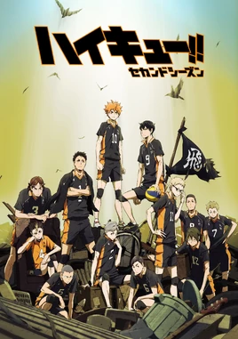

# Haikyu!! - Season 2

| |                             |
|--------------------|-----------------------------| 
| Release Date       | October 4, 2015             |
| Network            | MBS / TV Tokyo              |
| Genre              | Sports, Shonen              |
| Status             | Completed                   |
| Watch Start Date   | Mar 14, 2026                |
| Watch End Date     | Mar 21, 2026                |
| Total Episodes     | 25                          |
| Episodes Watched   | 25                          |
| Average Runtime    | 24 mins                     |
| Rating             | ★★★★☆ (4/5)                 |
| Platform           | Crunchyroll                 |
| Language           | English (Dub)               |
| Country            | Japan                       |

## Overview

Following the devastating loss to Aoba Johsai in the Interhigh, Karasuno must rebuild and evolve. Season 2 is split between a Tokyo training camp arc — where Karasuno trains alongside rival schools including Nekoma and Fukurodani — and the Spring High Preliminary tournament, culminating in rematches against familiar enemies with upgraded weapons. This is the season where individual characters stop being archetypes and become genuinely complex people.

## Story & Narrative

Season 2's structure is more patient than the first. The Tokyo camp arc (Episodes 1–13) deliberately slows the show's tempo for character-focused training. Each player is working on a specific weakness: Kageyama's ability to set to anyone, Hinata's ability to read the game without the quick, Tsukishima's lack of emotional investment in volleyball. The payoff comes not in one decisive match but in the cumulative transformation of who these players are.

The second half (Episodes 14–25) launches into the Spring High Preliminary, and the matches feel different because the players feel different. The Wakutani South match is a strong opener with genuine stakes. The long-awaited Aoba Johsai rematch is the season's showpiece — two episodes that feel like a full film's worth of catharsis. Karasuno defeating Oikawa is a moment Season 1 worked hard to make feel impossible, and Season 2 earns the payoff by showing exactly how much had to change for it to happen.

The final Shiratorizawa preview at the close of the season serves as an effective transition point — a reminder that Ushijima exists and that a completely different kind of challenge awaits.

What holds Season 2 just short of the first is pacing. The training camp arc, for all its character value, runs slightly long. Some individual training sessions feel repeated before they pay off. The show trusts its characters so much it occasionally forgets to push the plot. Still, no episode is wasted and no arc is hollow.

## Characters & Development

- **Tsukishima Kei** — The season's MVP. Season 1 positioned him as the show's most carefully withheld character, and Season 2 finally opens him up. The reveal of why he disengaged from volleyball — watching his brother's hope crushed by reality — is the season's best written scene. His moment blocking in the Aoba Johsai match is a legitimate emotional peak.
- **Kageyama Tobio** — Continues to evolve as a setter and a teammate. The Tokyo camp forces him to set to players who aren't Hinata, and what emerges is a more adaptable, more complete player. His growth is less dramatic than Tsukishima's but more fundamental.
- **Hinata Shoyo** — Pushed to develop as an individual player rather than half of a freak quick machine. Learning to participate in the game without the quick is a mature story choice — it makes him more threatening by making him more complete.
- **Oikawa Tooru** — The rematch gives him everything Season 1 promised. He serves, creates, adapts, and ultimately loses without any dimming of his greatness. One of anime's finest sporting defeats for a rival character.
- **Kenma Kozume** — The most thoughtful character in the show. Quiet, precise, and operating on a plane of volleyball intelligence that makes him fascinating to watch in the camp sequences alongside the more physically expressive players.
- **Yachi Hitoka** — A well-handled new addition as team manager. Her arc about overcoming self-doubt is kept compact and earnest, avoiding the clichés of the anxious-girl-gains-confidence trope.

## Production & Direction

Season 2 continues Production I.G's excellent work from the first season. The animation quality is consistent throughout, with the match sequences maintaining the fluid, physically precise style that made Season 1's volleyball so compelling. The training camp arc benefits from a more varied visual approach — more close-up character moments, quieter atmospheric shots — that fits the slower narrative pace. The sound design during key moments (blocks, serves, pivotal rallies) is particularly effective.

## Themes & Impact

- **Earned Growth**: Season 2 is explicitly about the process of getting better, shown in granular detail rather than through a training montage. It respects the audience's intelligence.
- **Individual vs Collective**: Each player's individual development in the camp arc serves the eventual collective performance in the tournament — the show keeps both scales in view at all times.
- **Rivals as Teachers**: Fukurodani's Bokuto serves as an unexpected mentor figure — a charismatic ace whose emotional volatility and ultimate mastery teaches the Karasuno players something about what commitment looks like at its extremes.
- **The Weight of Loss**: The Aoba Johsai rematch is a reckoning. The season remembers what Karasuno was humiliated with and methodically shows how each failure has been addressed.

## Episode Breakdown

### Episode 1: Let's Go to Tokyo!!
- **Air Date**: October 4, 2015
- **Date Watched**: Mar 21, 2026
- **Observations**:
  - Karasuno's direction post-loss is immediately clear: harder training, smarter play
  - Yachi Hitoka's introduction — the new manager — is charming and slightly chaotic
  - The Tokyo camp announcement reframes the season immediately as something different
- **Rating:** ★★★★ (4/5)
- **Notes:** Solid, purposeful premiere. Sets the reflective, growth-focused tone of the season well.

---

### Episode 2:上を向け (Look Up)
- **Air Date**: October 11, 2015
- **Date Watched**: Mar 21, 2026
- **Observations**:
  - Yachi's arc begins in earnest — her fear of volleyball's intensity is handled empathetically
  - Karasuno's training under Coach Ukai is more structured and demanding than Season 1's early episodes
  - Kageyama's limitations as a setter (can only truly set to one person) are put in focus
- **Rating:** ★★★½ (3.5/5)
- **Notes:** Good setup. Yachi works better than expected as a newcomer character.

---

### Episode 3: Declaration of War
- **Air Date**: October 18, 2015
- **Date Watched**: Mar 21, 2026
- **Observations**:
  - Kenma announced as a scout figure — watching Karasuno to catalogue their strategies
  - The battle of information before the camp begins
  - Tsukishima's resistance to genuine volleyball enthusiasm is foregrounded — the season's most interesting thread
- **Rating:** ★★★★ (4/5)
- **Notes:** The Tsukishima thread is the most compelling thing the show has going in the early episodes.

---

### Episode 4: Rivals
- **Air Date**: October 25, 2015
- **Date Watched**: Mar 21, 2026
- **Observations**:
  - Training begins — the multi-school camp format is immediately exciting
  - Fukurodani and its ace Bokuto are introduced; his personality is extraordinary
  - The sheer density of new rivals and their distinct volleyball cultures is impressive
- **Rating:** ★★★★ (4/5)
- **Notes:** Bokuto's arrival is an event. He's instantly one of the show's most entertaining characters.

---

### Episode 5: Evil Spiker
- **Air Date**: November 1, 2015
- **Date Watched**: Mar 21, 2026
- **Observations**:
  - Bokuto's mood swings and their effect on Fukurodani's team dynamic are explored brilliantly
  - Hinata begins learning from Bokuto despite no formal arrangement — pure observational learning
  - The camp starts to feel like a genuine crucible of different volleyball philosophies
- **Rating:** ★★★★ (4/5)
- **Notes:** Bokuto as an anxiety-ridden ace is a wonderful character touch. His teammates' exasperated affection for him is gold.

---

### Episode 6: Formation
- **Air Date**: November 8, 2015
- **Date Watched**: Mar 21, 2026
- **Observations**:
  - Kageyama forced to set to players outside his comfort zone — the challenge that changes him
  - The camp's brutal pace is conveyed through the exhaustion on the characters' faces
  - Hints of Tsukishima's underlying perfectionism beneath his apparent indifference
- **Rating:** ★★★½ (3.5/5)
- **Notes:** A grind episode in the best sense — showing the unflattering, repetitive nature of genuine improvement.

---

### Episode 7: Moonrise
- **Air Date**: November 15, 2015
- **Date Watched**: Mar 21, 2026
- **Observations**:
  - Tsukishima's backstory is revealed — his brother's dream crushed by the reality of sport
  - The scene is devastating and completely recontextualises his detachment
  - Kageyama and Hinata's parallel development paths made explicit
- **Rating:** ★★★★★ (5/5)
- **Notes:** The season's most important episode. Tsukishima finally explained — and the explanation is earned and tragic. The show's best character writing since Oikawa's backstory.

---

### Episode 8: Our Ace
- **Air Date**: November 22, 2015
- **Date Watched**: Mar 21, 2026
- **Observations**:
  - Bokuto in "depressed mode" — his teammates rallying him is both funny and unexpectedly moving
  - Hinata identifying and responding to what Bokuto needs from volleyball is a crucial observation
  - The ace's emotional dependence on the team is a new and humanising dimension
- **Rating:** ★★★★ (4/5)
- **Notes:** Bokuto's vulnerability is handled with real care. The show avoids making his mood swings purely comedic.

---

### Episode 9: The Formidable One
- **Air Date**: November 29, 2015
- **Date Watched**: Mar 21, 2026
- **Observations**:
  - Ushijima Wakatoshi makes his first real appearance — immediately communicates his threat level
  - His absolute certainty is a completely different kind of antagonism from Oikawa's psychological complexity
  - Hinata and Ushijima's brief interaction is electric
- **Rating:** ★★★★ (4/5)
- **Notes:** Ushijima is introduced perfectly. He doesn't need psychology or backstory to be frightening — he's simply better than everyone there.

---

### Episode 10: Desire for the Ball
- **Air Date**: December 6, 2015
- **Date Watched**: Mar 21, 2026
- **Observations**:
  - Hinata developing his ability to participate in rallies without the quick spike
  - Receiving and reading the game — skills that make him a complete player not just a weapon
  - The camp's final stages bring everything together
- **Rating:** ★★★½ (3.5/5)
- **Notes:** A necessary transitional episode. The Hinata development work feels authentic even if the episode itself is quieter.

---

### Episode 11: Nobody Beats Me
- **Air Date**: December 13, 2015
- **Date Watched**: Mar 21, 2026
- **Observations**:
  - Kenma's psychology as a player detailed more fully — playing not for passion but because stopping feels like giving up
  - The Karasuno vs Nekoma scrimmage begins — battle of contrasting styles
  - Kageyama's expanded setter toolkit on display
- **Rating:** ★★★★ (4/5)
- **Notes:** Kenma remains the show's most quietly compelling character. His motivation logic is counterintuitively inspiring.

---

### Episode 12: The Promised Land
- **Air Date**: December 20, 2015
- **Date Watched**: Mar 21, 2026
- **Observations**:
  - The camp closes with Karasuno feeling genuinely transformed
  - Retrospective on what each player has gained
  - The shift in team confidence is palpable and earned
- **Rating:** ★★★★ (4/5)
- **Notes:** A satisfying intermission. The camp arc is resolved with a sense of clear forward momentum.

---

### Episode 13: Quitter's Regret
- **Air Date**: December 27, 2015
- **Date Watched**: Mar 21, 2026
- **Observations**:
  - Karasuno's return home; preparation for the Spring High Preliminary
  - Yachi's arc concluded — she commits fully and is wonderful for it
  - New strategies and serves from Kageyama teased as Spring High approaches
- **Rating:** ★★★ (3/5)
- **Notes:** A transitional episode, slightly padded. Works as setup but little else.

---

### Episode 14: Crazy Setting
- **Air Date**: January 10, 2016
- **Date Watched**: Mar 21, 2026
- **Observations**:
  - Spring High Preliminary begins — Karasuno reintroduced on a new stage
  - Kageyama's new serve unveiled; it's immediately frightening
  - The gap between old Karasuno and the current team is visible from the first rally
- **Rating:** ★★★★ (4/5)
- **Notes:** The tournament arc begins with energy. Kageyama's jump serve is a declaration of intent for the whole season.

---

### Episode 15: The Iron Wall Can Be Rebuilt
- **Air Date**: January 17, 2016
- **Date Watched**: Mar 21, 2026
- **Observations**:
  - Date Tech returns — the rematch against the iron wall
  - The blocking is as suffocating as ever but Karasuno has grown around it
  - Asahi's confidence against the wall that once broke him
- **Rating:** ★★★★★ (5/5)
- **Notes:** A beautiful reversal of Season 1's emotional arc for Asahi. The iron wall that once seemed invincible now just seems like a problem to be solved.

---

### Episode 16: Ex-Neighbourhood Association
- **Air Date**: January 24, 2016
- **Date Watched**: Mar 21, 2026
- **Observations**:
  - Karasuno defeats Date Tech — a clean and satisfying conclusion to that rivalry for now
  - The team's confidence continues to build without hubris
  - Aoba Johsai on the horizon; the atmosphere shifts
- **Rating:** ★★★★ (4/5)
- **Notes:** The Date Tech win lands well. A necessary bookending of the Season 1 injury.

---

### Episode 17: Wakutani South's Ace
- **Air Date**: January 31, 2016
- **Date Watched**: Mar 21, 2026
- **Observations**:
  - Wakutani South and their ace Makki — a genuinely difficult challenge
  - The match tests Karasuno's new systems under real pressure
  - A harder-than-expected test serves as a reminder not to sleep on any opponent
- **Rating:** ★★★½ (3.5/5)
- **Notes:** A good tournament episode that avoids being merely transitional by giving Wakutani South actual character.

---

### Episode 18: The Third Meeting
- **Air Date**: February 7, 2016
- **Date Watched**: Mar 21, 2026
- **Observations**:
  - Prepare for Aoba Johsai — Karasuno knows what's coming and so does the audience
  - Oikawa's scouting and tactical adjustment is shown from his perspective
  - The emotional weight of what this rematch means is established with excellent restraint
- **Rating:** ★★★★ (4/5)
- **Notes:** A great pre-climax episode. The anticipation is handled without over-explaining it.

---

### Episode 19: Betting It All
- **Air Date**: February 14, 2016
- **Date Watched**: Mar 21, 2026
- **Observations**:
  - Karasuno vs Aoba Johsai begins — immediately at full intensity
  - Oikawa's serve is as devastating as it was, and Karasuno's receive is tested immediately
  - All the camp arc development tested against the hardest possible standard
- **Rating:** ★★★★★ (5/5)
- **Notes:** Everything the training arc built for lands here. The match has the quality of a season finale with two episodes still left.

---

### Episode 20: The Volleyball Idiots
- **Air Date**: February 21, 2016
- **Date Watched**: Mar 21, 2026
- **Observations**:
  - The match reaches its decisive moments — neither team yields
  - Tsukishima's block against Oikawa: the season's single best moment
  - Karasuno wins — earned, not gifted
- **Rating:** ★★★★★ (5/5)
- **Notes:** Tsukishima's block is the season's peak moment. One point that repays every single episode of his backstory. Elite sports anime storytelling.

---

### Episode 21: Challenger
- **Air Date**: February 28, 2016
- **Date Watched**: Mar 21, 2026
- **Observations**:
  - Karasuno celebrates; the emotional exhale is real
  - Oikawa's defeat is handled with dignity — no collapse, no excuses
  - Shiratorizawa awaits — the announcement lands with appropriate weight
- **Rating:** ★★★★ (4/5)
- **Notes:** The emotional fall from the Aoba Johsai peak is handled gracefully. Oikawa leaving the story here is a genuinely affecting moment.

---

### Episode 22: Sets and Cats
- **Air Date**: March 6, 2016
- **Date Watched**: Mar 21, 2026
- **Observations**:
  - Spring High Preliminary semi-finals begin
  - Karasuno vs an intermediate opponent before the Shiratorizawa clash
  - The team continues to evolve tactically even mid-tournament
- **Rating:** ★★★ (3/5)
- **Notes:** Slightly routine by the season's standards. A palate cleanser between peaks.

---

### Episode 23: Pitons
- **Air Date**: March 13, 2016
- **Date Watched**: Mar 21, 2026
- **Observations**:
  - Ushijima's Shiratorizawa shown in action — their dominance is total and terrifying
  - The contrast between Shiratorizawa's overwhelming force and Karasuno's technical ingenuity
  - Hinata and Ushijima's second encounter — the gap in ability is confrontational
- **Rating:** ★★★★ (4/5)
- **Notes:** Ushijima's volleyball is genuinely frightening to watch. The showdown has enormous build.

---

### Episode 24: 合体 (Combination)
- **Air Date**: March 20, 2016
- **Date Watched**: Mar 21, 2026
- **Observations**:
  - Final preparation; the tactical game plan against Shiratorizawa's power game
  - Character states before the biggest match any of them have ever played
  - Kageyama and Hinata's partnership at its most cohesive and confident
- **Rating:** ★★★★ (4/5)
- **Notes:** Good pre-finale episode. The tension before the Shiratorizawa match is effectively constructed.

---

### Episode 25: The Third Gym
- **Air Date**: March 27, 2016
- **Date Watched**: Mar 21, 2026
- **Observations**:
  - Teaser of the Shiratorizawa match — showing just enough to make waiting painful
  - The season ends on the threshold of the show's defining match
  - Karasuno walking into the Shiratorizawa match transformed from who they were
- **Rating:** ★★★★ (4/5)
- **Notes:** A cliffhanger that trusts the audience's investment. Season 3 is immediately necessary.

---

### Rating Breakdown

| Category | Score | Notes |
|---|---|---|
| **Visuals** | **8.5** | Consistent quality; the camp arc's smaller-scale moments handled with care. |
| **Plot** | **8.0** | Strong structure but the camp arc runs slightly long before the payoff. |
| **Characters** | **9.5** | Tsukishima's arc alone elevates this significantly. The entire ensemble deepened. |
| **Enjoyment** | **8.5** | Slower burn than Season 1 but the rewards are larger. |
| **Overall** | **8.6** | **Excellent** (A character-first season that earns its emotional peaks) |

---

## Verdict

**Season Rating: ★★★★☆ (4/5)**

Season 2 is a more patient, character-rich season than its predecessor. Where Season 1 won by structural confidence and an outstanding climax, Season 2 wins through accumulation — dozens of small character moments that make the big moments enormous. Tsukishima's block in Episode 20 is the season's definitive moment, and it works because the show spent seven episodes carefully explaining exactly why it mattered.

The slightly padded camp arc prevents this from matching Season 1's purity of construction, but as a character exploration it may actually be the richer watch. Kageyama, Hinata, Tsukishima, Yachi — everyone has grown into someone more interesting. Oikawa's final defeat is handled with the gravity and dignity it deserved. Season 2 leaves you genuinely ready for everything Season 3 promises.

---

## Personal Notes & Observations

- Tsukishima went from the character I was least interested in to the one I cared most about. That's exceptional writing.
- Bokuto is perpetually one scene away from stealing the show. His brief presence here makes you wish the show followed Fukurodani.
- The camp arc pacing is the only real criticism. Individual episodes within it are good; collectively it stretches.
- Oikawa's exits — dignified, uncommented-on, with the shadow of what could have been — are the kind of sporting exits that haunt you.

### Memorable Moments

- Episode 7: Tsukishima's backstory — his brother's dream quietly ending.
- Episode 15: Asahi spiking through Date Tech's wall with no hesitation.
- Episode 20: Tsukishima's one crucial block in the Aoba Johsai match.
- Episode 19–20: The entire Aoba Johsai rematch, sustained over two episodes at the highest level.

---

## Additional Context

- Season 2 covers the "Tokyo Expedition" and first half of "Spring High Preliminary" manga arcs.
- Adapted by Production I.G from Haruichi Furudate's manga, which was mid-run at this point.
- The Fukurodani training camp school would later receive their own OVA series.
- This season introduced fan favourite Yachi Hitoka, who became one of the manga's most beloved supporting characters.

---
