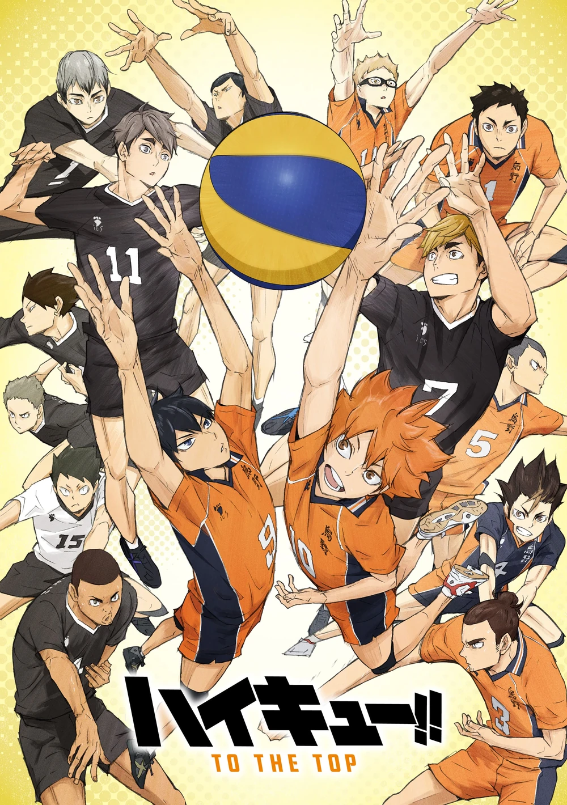

# Haikyu!! - Season 4: To The Top

| |                             |
|--------------------|-----------------------------| 
| Release Date       | January 11, 2020            |
| Network            | MBS / TV Tokyo              |
| Genre              | Sports, Shonen              |
| Status             | Completed                   |
| Watch Start Date   | Mar 21, 2026                |
| Watch End Date     | Mar 21, 2026                |
| Total Episodes     | 25                          |
| Episodes Watched   | 25                          |
| Average Runtime    | 24 mins                     |
| Rating             | ★★★★★ (5/5)                 |
| Platform           | Crunchyroll                 |
| Language           | English (Dub)               |
| Country            | Japan                       |

## Series Navigation

| | |
|:---|:---|
| **Prequel** | [Haikyu!! — Season 3: Karasuno vs. Shiratorizawa](season_3.md) ★★★★★ (5/5) |
| **Sequel** | [*Haikyu!! The Dumpster Battle* (2024 film)](https://github.com/taifur-rahaman/Movie-Reviews/blob/main/titles/haikyu_the_dumpster_battle.md) ★★★⯪☆ (7.5/10) |

---

## Overview

Haikyu!! To The Top is the fourth and final season of the series, released in two split cours spanning 2020. Following their victory over Shiratorizawa, Karasuno finally reaches Nationals in Tokyo. The first cour covers pre-Nationals training alongside elite national-level threats; the second cour delivers the Nationals themselves — beginning with a first-round match against Tsubakihara and building to the season's centrepiece: Karasuno vs. Inarizaki, a jaw-dropping encounter against a team with two of the country's most feared players.

## Story & Narrative

Season 4 opens with a deliberate shift in scale. Kageyama and Hinata are separately selected for national youth training camps — different camps, reflecting their different trajectories. This separation is the season's structural masterstroke. Watching them grow apart in skill, approach, and understanding for the first thirteen episodes makes their eventual reunion on the Nationals court feel like a genuine dramatic event.

The first cour (Episodes 1–13) juggles Kageyama's camp with the precision development of Hinata sneaking into a different camp to absorb information as a ball boy. Both arcs are handled with care. Kageyama's national-level training — surrounded by setters who operate with a fluidity beyond anything he's encountered — pushes him toward a fuller, more improvisational style. Hinata's experience, disguised as service staff, covers something different: observation, intelligence, and the realization that his ability to read volleyball is more developed than he understood.

The second cour (Episodes 14–25) is the Nationals arc, and it is the season at its most spectacular. The Tsubakihara match is handled efficiently — a first-round win without being a walkover, used more as a temperature-check than an event. Then Inarizaki arrives. Two episodes in, it's clear this is the season's true mountain. Miya Atsumu is the best setter Kageyama has ever faced. Miya Osamu is an intuitive spiker who plays as if volleyball is a second language he was born fluent in. The Sakusa Kiyoomi appearance tantalizes without fully delivering — correctly, since the real confrontation was never this season's mandate.

The Inarizaki match is as sustained and precise as the Shiratorizawa match was. What distinguishes it is its soundtrack. Inarizaki's crowd — their school band playing against Karasuno's every rally — becomes a character in itself. The pressure of playing against organized, rhythmic noise targeting your concentration is something no previous season has used this way, and it creates an atmosphere unlike any prior Haikyu!! match.

## Characters & Development

- **Miya Atsumu** — The season's finest new character. A setter of breathtaking technical ability, infuriating arrogance, and genuine charisma. His volleyball philosophy — serve as an attack, set as an assault — is a different language from Kageyama's, and the contrast is intellectually rich. He is simultaneously the season's primary antagonist and its most compelling newcomer.
- **Kageyama Tobio** — His national camp arc shows him encountering, for the first time, players who make his style look limited. The adaptation is quiet but fundamental — by Nationals he's a different setter entirely. The growth arc across four seasons is one of the best long-form character developments in the genre.
- **Hinata Shoyo** — The most transformed across this season. The ball-boy arc at first seems like a humbling; it becomes instead the moment Hinata develops the volleyball intelligence that had always been his structural limitation. By the time of the Inarizaki match, he's terrifying in a way he wasn't in Seasons 1–3.
- **Miya Osamu** — Less flashy than his twin, more instinctive. His ability to read plays in real time without the quick-calculated precision of Kageyama makes him feel like a completely different model of volleyball player.
- **Suna Rintarō** — Inarizaki's spike-blocker read specialist is an exceptional supporting antagonist: calm where others are emotional, consistent where others have peaks and troughs.
- **Kita Shinsuke** — Inarizaki's captain is one of the series' most striking supporting characters. His value statement — consistency over brilliance, showing up regardless of result — is the season's thematic backbone.

## Production & Direction

Season 4 is produced by Production I.G with continuation of the visual standards established across the earlier seasons. The Inarizaki match's animation is the season's technical peak — particularly the serves and the crowd sequences. The decision to give Inarizaki's band a sonic presence in the show's actual soundtrack is inspired: the brass music during Karasuno's rallies isn't background — it's pressure, represented in sound. The colour palette in the Nationals venue (a larger, more institutional gymnasium than anything previous) is handled thoughtfully: overwhelming at first, then familiar as the season progresses, mirroring Karasuno's psychological journey.

## Themes & Impact

- **Scale and Pressure**: Nationals is not a bigger version of the prefecture tournament. The atmosphere, the crowds, the quality of opponents — everything is different, and the show is careful to make the players feel that difference rather than simply telling the audience about it.
- **Music as Intimidation**: Inarizaki's crowd using coordinated cheering and band music against Karasuno is the season's most original tactical element — not a volleyball strategy but a psychological one, and the season treats it with complete seriousness.
- **Growth Requires Separation**: Kageyama and Hinata developing apart before returning together is the season's thematic spine. You cannot improve a partnership without improving the individuals separately.
- **Consistency Over Inspiration**: Kita Shinsuke's philosophy — showing up fully every time, regardless of inspiration — is the show's most mature thematic statement. It's a direct challenge to the Hinata model of passion-driven volleyball.

## Episode Breakdown

### Episode 1: A New Battlefield
- **Air Date**: January 11, 2020
- **Date Watched**: Mar 21, 2026
- **Observations**:
  - The scale shift to Nationals immediately communicated — bigger teams, bigger names, bigger pressure
  - Kageyama's invitation to the youth training camp announced
  - A fresh Haikyu!! chapter feeling earned rather than forced
- **Rating:** ★★★★ (4/5)
- **Notes:** A confident season opener. The show knows exactly what it wants from this season and wastes no time signalling it.

---

### Episode 2: Promise
- **Air Date**: January 18, 2020
- **Date Watched**: Mar 21, 2026
- **Observations**:
  - Hinata's alternative plan revealed — sneaking into a different camp as a ball boy
  - The audacity of the move fits him perfectly; the execution is both absurd and completely in character
  - The two paths — Kageyama's invitation, Hinata's infiltration — establish the season's philosophical split
- **Rating:** ★★★★ (4/5)
- **Notes:** Hinata's ball-boy decision is the season's best early idea. Watching training from the outside turns out to be exactly what he needed.

---

### Episode 3: The Arrival of Spring
- **Air Date**: January 25, 2020
- **Date Watched**: Mar 21, 2026
- **Observations**:
  - Miya Atsumu's first appearance — immediate, overwhelming presence
  - His serve introduced as a psychological weapon as much as a physical one
  - The national-level talent gap is shown without being discouraged
- **Rating:** ★★★★ (4/5)
- **Notes:** Atsumu's entrance is as effective as Oikawa's was in Season 1. The show has a gift for introductions.

---

### Episode 4: Read and React
- **Air Date**: February 1, 2020
- **Date Watched**: Mar 21, 2026
- **Observations**:
  - Kageyama surrounded by national-level setters — his comparative limitations visible for the first time
  - His response: observation, adaptation, rather than defensiveness
  - Hinata absorbing volume from the sidelines — a completely different kind of learning
- **Rating:** ★★★★ (4/5)
- **Notes:** The parallel development structure is excellent. Each character's learning environment teaches exactly what they need.

---

### Episode 5: The Volleyball Idiots, Part 2
- **Air Date**: February 8, 2020
- **Date Watched**: Mar 21, 2026
- **Observations**:
  - Atsumu's setting philosophy revealed — every toss a custom-made weapon for the spiker
  - The contrast with Kageyama (who makes the spiker conform to his toss) is intellectually provocative
  - Hinata watching from the floor, cataloguing everything
- **Rating:** ★★★★ (4/5)
- **Notes:** The setter philosophy debate is the season's best intellectual content. Two different philosophies, both correct on their own terms.

---

### Episode 6: A Chance to Connect
- **Air Date**: February 15, 2020
- **Date Watched**: Mar 21, 2026
- **Observations**:
  - Kageyama begins adapting his style to accommodate new conceptions of setting
  - The process is uncomfortable and visibly difficult — the show doesn't smooth over the awkwardness
  - Hinata making acquaintances with national-level players above his current ability level
- **Rating:** ★★★★ (4/5)
- **Notes:** Growth is shown as genuinely difficult here, not inspirational. The harder Kageyama process is more honest than any training montage.

---

### Episode 7: Good Morning
- **Air Date**: February 22, 2020
- **Date Watched**: Mar 21, 2026
- **Observations**:
  - Kita Shinsuke is introduced — Inarizaki's extraordinary captain
  - His philosophy of consistency over inspiration is stated and shown immediately
  - A quieter, more philosophical episode that sets up the season's thematic framework
- **Rating:** ★★★★★ (5/5)
- **Notes:** Kita is one of the show's most interesting characters — someone whose greatness is entirely undramatic, and therefore more challenging to everything the show's usual heroes believe.

---

### Episode 8: What is the Team
- **Air Date**: February 29, 2020
- **Date Watched**: Mar 21, 2026
- **Observations**:
  - The training camps conclude — both Kageyama and Hinata return changed
  - Their reunion is deliberately understated — the show knows the gap is best shown in practice
  - Karasuno preparing for Nationals; the final preparations feel genuinely different from before
- **Rating:** ★★★★ (4/5)
- **Notes:** The reunion is played exactly right — not dramatically but functionally. Who they are now is shown in action, not announced.

---

### Episode 9: The Path of the Ball
- **Air Date**: March 7, 2020
- **Date Watched**: Mar 21, 2026
- **Observations**:
  - Karasuno training with the new systems — the chemistry tests before Nationals
  - The quick attack has evolved; the freak quick is no longer Hinata's entire game
  - Hints of the Inarizaki serve threat — a new problem requiring a new solution
- **Rating:** ★★★½ (3.5/5)
- **Notes:** A good connective episode. The mechanics are functional even if the drama is lower-key.

---

### Episode 10: A Chance to Connect (Part 2)
- **Air Date**: March 14, 2020
- **Date Watched**: Mar 21, 2026
- **Observations**:
  - Final Nationals preparation — the team in its best-ever collective form
  - Nishinoya's receive training pushed to new standards
  - The emotional temperature rising as Tokyo approaches
- **Rating:** ★★★★ (4/5)
- **Notes:** The anticipation is effectively built without over-telegraphing what's coming.

---

### Episode 11: The Second Day
- **Air Date**: March 21, 2020
- **Date Watched**: Mar 21, 2026
- **Observations**:
  - Nationals begin — the scale of the venue and competition immediately overwhelming
  - Karasuno finds their feet; the Tsubakihara match confirmed as the first test
  - Observing other national-level matches running concurrently
- **Rating:** ★★★★ (4/5)
- **Notes:** The Nationals atmosphere is captured with real grandeur. The simultaneous matches in other courts convey scale without distracting.

---

### Episode 12: The Hype-Up Strategy
- **Air Date**: March 28, 2020
- **Date Watched**: Mar 21, 2026
- **Observations**:
  - Inarizaki's crowd hype strategy previewed — fan coordination, band, organised noise
  - The psychological pressure this creates even before the match is extraordinary
  - Karasuno's response debated — you cannot out-cheer Inarizaki, so what can you do
- **Rating:** ★★★★ (4/5)
- **Notes:** The organised crowd-as-weapon concept is immediately fresh. Sports anime rarely weaponises the atmosphere this directly.

---

### Episode 13: Kokoro ga Nai (No Heart)
- **Air Date**: April 4, 2020
- **Date Watched**: Mar 21, 2026
- **Observations**:
  - First cour ends — Tsubakihara match resolved efficiently
  - Inarizaki looms; the emotional runway built across 13 episodes is complete
  - A quiet episode that knows the real story begins next cour
- **Rating:** ★★★ (3/5)
- **Notes:** Works as a structural endpoint even if it's lighter dramatically. The show correctly doesn't over-dramatise a first-round win.

---

### Episode 14: Let the Games Begin
- **Air Date**: October 3, 2020
- **Date Watched**: Mar 21, 2026
- **Observations**:
  - Second cour begins — Karasuno vs. Inarizaki opens
  - Inarizaki's band immediately in effect — the sound pressure is novel and disorienting
  - Miya Atsumu's first serve against Karasuno: it lives up to everything previewed
- **Rating:** ★★★★ (4/5)
- **Notes:** The match opens exactly right — overwhelming, disorienting, and completely compelling.

---

### Episode 15: Spiderweb
- **Air Date**: October 10, 2020
- **Date Watched**: Mar 21, 2026
- **Observations**:
  - Atsumu's serve dissected — it's designed to make the receive good but the subsequent set compromised
  - Suna Rintaro reading blocks in real time — a genuinely novel threat
  - Karasuno establishing their counter-system under sustained pressure from multiple vectors
- **Rating:** ★★★★ (4/5)
- **Notes:** The tactical detail in these episodes is extraordinary. Every Inarizaki player has a distinct and intelligent role.

---

### Episode 16: Roar
- **Air Date**: October 17, 2020
- **Date Watched**: Mar 21, 2026
- **Observations**:
  - Inarizaki's band playing specifically to disrupt Karasuno's rhythm — timing attacks during serves
  - Karasuno finding their counterpoint — generating internal noise, crowd, energy to override the band
  - The psychological battle becomes as important as the tactical one
- **Rating:** ★★★★★ (5/5)
- **Notes:** The soundtrack-as-weapon concept reaches its peak. This episode would make no sense in a different sports anime — it's uniquely, perfectly Haikyu.

---

### Episode 17: Aloft
- **Air Date**: October 24, 2020
- **Date Watched**: Mar 21, 2026
- **Observations**:
  - Kageyama's evolved setting on full display — the camp's lessons translated into match intelligence
  - Atsumu vs. Kageyama as a setter duel — the season's central intellectual conflict made explicit
  - Hinata reading the game in ways that would have been impossible even in Season 3
- **Rating:** ★★★★★ (5/5)
- **Notes:** The growth across four seasons converges here. Kageyama and Hinata as national-level threats is not just claimed — shown.

---

### Episode 18: Twins
- **Air Date**: October 31, 2020
- **Date Watched**: Mar 21, 2026
- **Observations**:
  - Miya twin dynamics explored — their instinctive volleyball communication unlike any other pair in the series
  - Osamu's individuality within the twin identity — he's not Atsumu's shadow but his complement
  - The Karasuno mechanisms beginning to crack Inarizaki's system
- **Rating:** ★★★★ (4/5)
- **Notes:** The twin dynamic is handled with intelligence. Osamu's intuitiveness makes him unpredictable in a way that pure precision never could.

---

### Episode 19: The Second Day, Part 2
- **Air Date**: November 7, 2020
- **Date Watched**: Mar 21, 2026
- **Observations**:
  - The match nears its decisive phase — Karasuno taking a set off Inarizaki
  - Kita's substitution in — consistency applied at the moment it's most needed
  - The emotional weight of passing Kita's final match is handled with appropriate gravity
- **Rating:** ★★★★★ (5/5)
- **Notes:** Kita subbing in is one of the season's most effective moments. The quiet player who shows up fully, one last time.

---

### Episode 20: Turn
- **Air Date**: November 14, 2020
- **Date Watched**: Mar 21, 2026
- **Observations**:
  - The deciding set — both teams fully committed and without reserve
  - Inarizaki's crowd reaches its peak intensity
  - Hinata's complete player in full display — he's not the freak quick anymore, he's the total player
- **Rating:** ★★★★★ (5/5)
- **Notes:** Every piece of this season has led here. The decisive set is the show's most mature sustained volleyball drama.

---

### Episode 21: The Challengers
- **Air Date**: November 21, 2020
- **Date Watched**: Mar 21, 2026
- **Observations**:
  - Inarizaki's final push — everything they have, every weapon deployed
  - Karasuno answering point for point — neither team backing down
  - The crowd dynamics in the final games are spectacular
- **Rating:** ★★★★★ (5/5)
- **Notes:** Relentless. The show maintains peak tension without a single loose moment across these final episodes.

---

### Episode 22: Cats vs. Owls
- **Air Date**: November 28, 2020
- **Date Watched**: Mar 21, 2026
- **Observations**:
  - Karasuno defeats Inarizaki — the full relief and disbelief made visible
  - Inarizaki leaves with full dignity; Atsumu's reaction is perfectly written
  - Nekoma vs. Sarukawa Tech shown — the Battle of the Garbage Dump approaching
- **Rating:** ★★★★ (4/5)
- **Notes:** Atsumu's reaction to losing is the season's best-written emotional beat for an antagonist. He's devastated without being diminished.

---

### Episode 23: Heart
- **Air Date**: December 5, 2020
- **Date Watched**: Mar 21, 2026
- **Observations**:
  - The aftermath — Karasuno advancing, Nekoma still fighting
  - The cat-vs-crow confrontation finally confirmed as imminent
  - A breath-catch episode between two peaks
- **Rating:** ★★★½ (3.5/5)
- **Notes:** A necessary transitional episode that serves its purpose without quite being an event in itself.

---

### Episode 24: The Battle of Garbage Dump
- **Air Date**: December 12, 2020
- **Date Watched**: Mar 21, 2026
- **Observations**:
  - Nekoma vs. Karasuno at Nationals — the match the series has been building toward since Episode 9 of Season 1
  - Kenma vs. Kageyama/Hinata: brains vs. firepower
  - The tactical intelligence of the match is the show's richest — every play a response to the previous
- **Rating:** ★★★★★ (5/5)
- **Notes:** Worth every episode of waiting. The Garbage Dump match has a completely different emotional quality from every prior match — it feels like coming home.

---

### Episode 25: To the Top
- **Air Date**: December 19, 2020
- **Date Watched**: Mar 21, 2026
- **Observations**:
  - Karasuno defeats Nekoma — Kenma's response to losing is the episode's finest moment
  - The season closes with Karasuno still standing, still hungry, still unfinished
  - The series ends where it began: a boy who wants to fly, still running
- **Rating:** ★★★★★ (5/5)
- **Notes:** A genuinely moving finale. Kenma's farewell to volleyball is the most emotionally precise moment of the entire series. The show ends correctly: not with a championship, but with the promise of one.

---

### Rating Breakdown

| Category | Score | Notes |
|---|---|---|
| **Visuals** | **9.0** | The Inarizaki match sequences are Production I.G's finest since Season 3. The crowd scenes are exceptional. |
| **Plot** | **9.0** | Two-cour structure used well; the camp arc feeds directly into the Nationals match quality. |
| **Characters** | **9.5** | Atsumu, Kita, Kenma, and the Karasuno ensemble all at their peaks. Kageyama and Hinata's growth is fully visible. |
| **Enjoyment** | **9.5** | The Inarizaki match is the show's most enjoyable sustained run since the Shiratorizawa arc. |
| **Overall** | **9.3** | **Excellent** (A triumphant, emotionally intelligent final season) |

---

## Verdict

**Season Rating: ★★★★★ (5/5)**

Haikyu!! To The Top is a worthy, emotionally complete finale to one of the finest sports anime series in the medium. The Miya Atsumu introduction is the series' best since Oikawa in Season 1 — a rival who is genuinely frightening, philosophically interesting, and impossible not to respect. The Inarizaki match is the show at its most creative: the crowd-as-weapon concept, the band music, the twin dynamics, the setter duel — it's more inventive than any prior match while retaining everything that makes Haikyu's volleyball feel real.

What elevates the season to the top rating is its finale. Kenma's farewell to volleyball in the final episode is the most quietly devastating thing the show has done. A character who played not out of love but out of something more complicated — obligation, habit, the identity wrapped around a sport he was drawn to despite himself — finally stopping. And feeling, in that final moment, something he didn't expect. That is the kind of emotional honesty that separates genuinely great sports stories from merely excellent ones.

Haikyu is the complete article: a sports anime that understands sport, people, failure, growth, and the specific unrepeatable feeling of a team going somewhere together.

---

## Personal Notes & Observations

- Atsumu is the most interesting rival the series produced. He's not sympathetic in the Oikawa way, not imposing in the Ushijima way — he's something newer: talented, arrogant, and strangely delightful.
- Kita Shinsuke's consistency philosophy stayed with me. The idea that showing up non-dramatically is itself a form of excellence is something the show argues better than most motivational content.
- Kenma's final episode reaction to losing is as good a single character moment as Tsukishima's block in Season 3. Both are payoffs to journeys that took multiple seasons to complete.
- The band music during the Inarizaki match is genuinely clever. The show found a way to make its own score a narrative element, not just accompaniment.

### Memorable Moments

- Episode 7: Kita Shinsuke practising alone — consistency as a philosophy shown rather than stated.
- Episode 16: The band music as psychological warfare — the show's most inventive single episode concept.
- Episode 19: Kita's substitution — the captain showing up one final time with full presence.
- Episode 24: The Garbage Dump match, finally realised, living up to every episode of anticipation.
- Episode 25: Kenma stopping. The series ending not with a trophy but with a feeling.

---

## Additional Context

- Season 4 was released in two split cours: Cour 1 (January–April 2020) and Cour 2 (October–December 2020), delayed by COVID-19 pandemic.
- The "Nationals" arc continues beyond Season 4 in the manga, which concluded in 2020 with a time-skip epilogue.
- Following the anime, the series concluded with theatrical films covering additional Nationals matches.
- Miya Atsumu went on to become one of the manga's most beloved characters following his introduction here.
- Season 4 adapts the "Spring High Nationals" arc — the largest and most ambitious arc in the original manga.

---
