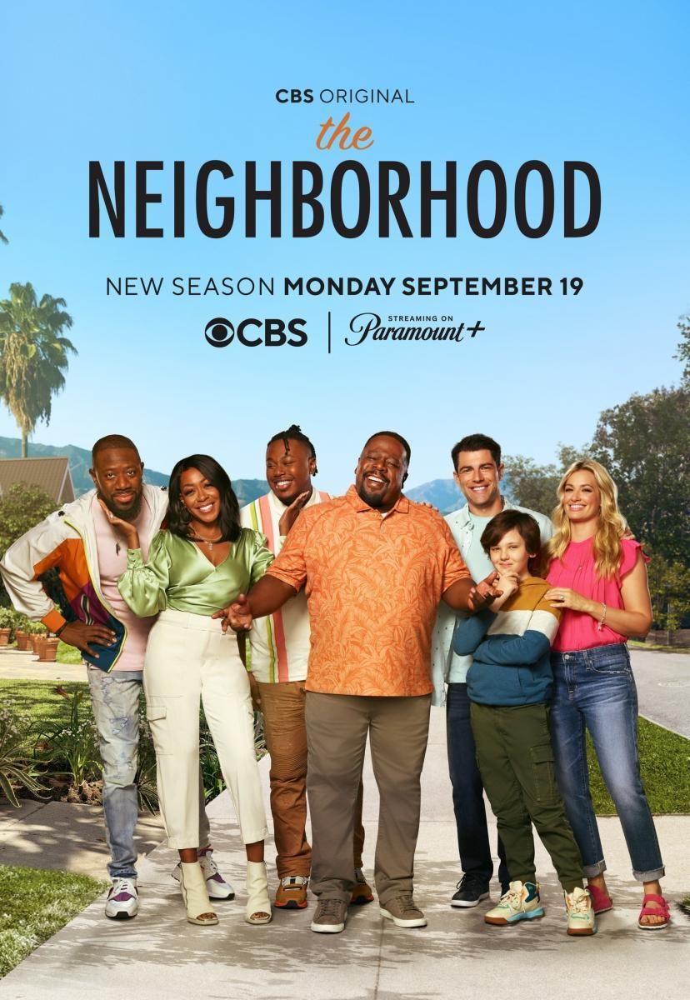

# The Neighborhood - Season 1

| |                             |
|--------------------|-----------------------------| 
| Release Date       | October 1, 2018             |
| Network            | CBS                         |
| Genre              | Comedy, Sitcom              |
| Status             | Watching                    |
| Watch Start Date   | Feb 13, 2026                |
| Watch End Date     | Ongoing                     |
| Total Episodes     | 21                          |
| Episodes Watched   | 1                           |
| Average Runtime    | 22 mins                     |
| Rating             | TBD                         |
| Platform           | Home                        |
| Language           | English                     |
| Country            | USA                         |

## Overview

Dave Johnson moves his family from Michigan to a mostly Black neighborhood in Los Angeles. His super-friendly, overly optimistic personality clashes with his new neighbor Calvin Butler, who is protective of his neighborhood and skeptical of Dave's "let's all be best friends" energy. The show explores culture clash, assumptions, and two very different personalities learning how to live next door to each other.

## Story & Narrative

**(Episode 1)**
The pilot establishes the central dynamic perfectly: Dave Johnson is the kind of guy who thinks being friendly and enthusiastic will solve everything, while Calvin Butler is protective of his neighborhood and immediately puts his guard up against this overly cheerful newcomer. 

Dave keeps trying to bond through small talk and neighborly gestures, but Calvin isn't having it. He's skeptical of Dave's intentions and wary of what this change means for his community. Meanwhile, their wives are more open-minded and practical, helping to ease some of the tension between the two men.

By the end of the episode, they don't exactly become friends, but there's a small shift—Calvin starts to see that Dave might genuinely mean well, even if his approach is exhausting. It's a good setup for the series: two completely different people with different backgrounds and perspectives learning to coexist.

## Characters & Development

**Dave Johnson** is the newcomer from Michigan who moves his family to a mostly Black neighborhood in Los Angeles. He's overly friendly, optimistic to a fault, and genuinely believes his super-friendly personality will win everyone over. He immediately tries to connect with his neighbors, especially Calvin, through constant small talk and neighborly gestures. While his intentions seem genuine, his approach can come across as tone-deaf or exhausting.

**Calvin Butler** is Dave's next-door neighbor who is protective of his neighborhood and immediately skeptical of Dave's overly cheerful energy. He keeps his guard up and isn't impressed by Dave's attempts at friendship. Calvin represents someone who has seen his community change over time and is wary of what this new arrival might mean. Despite his initial resistance, by the end of the first episode, there's a hint that he might start to see Dave's genuine intentions.

**The Wives** (Dave's and Calvin's) are more open-minded and practical than their husbands. They help ease some of the tension between Dave and Calvin, serving as mediators and voices of reason. They seem more willing to give each other a chance and look past the surface-level differences.

## Production & Direction

The show has a classic sitcom feel with a studio audience or laugh track. The pacing is typical for a CBS comedy—quick setups, punchlines, and character-driven humor. The direction keeps things light and accessible.

## Themes & Impact

- **Culture Clash**: The show directly addresses the tension that comes when different cultures and backgrounds collide in a neighborhood setting.
- **Assumptions**: Both Dave and Calvin make assumptions about each other based on their backgrounds and experiences.
- **Community and Change**: The series explores how neighborhoods evolve and how people react to change in their communities.
- **Finding Common Ground**: Despite their differences, the show hints at the possibility of connection and understanding.

## Episode Breakdown

### Episode 1: Pilot
- **Date Watched**: February 13, 2026
- **Observations**:
  - Dave Johnson moves his family from Michigan to a mostly Black neighborhood in Los Angeles, believing his super-friendly personality will win everyone over. He immediately tries to connect with his new neighbors, especially Calvin Butler, but Calvin isn't impressed.
  - Calvin is protective of his neighborhood and skeptical of Dave's overly cheerful, "let's all be best friends" energy. While Dave keeps trying to bond through small talk and neighborly gestures, Calvin keeps his guard up. Their wives are more open-minded and practical, helping ease some of the tension.
  - By the end of the episode, they don't exactly become friends, but there's a small shift—Calvin starts to see that Dave might genuinely mean well. The episode sets up the central theme of the show: culture clash, assumptions, and two very different personalities learning how to live next door to each other.
- **Rating:** TBD
- **Notes:** Good pilot that establishes the central dynamic and conflict. The chemistry between the leads will be key to the show's success.

---

### Rating Breakdown

| Category | Score | Notes |
|---|---|---|
| **Visuals** | **TBD** | |
| **Plot** | **TBD** | |
| **Characters** | **TBD** | |
| **Enjoyment** | **TBD** | |
| **Overall** | **TBD** | |

---

## Personal Notes & Observations

- The show tackles culture clash and neighborhood dynamics in a sitcom format.
- Dave's overly friendly approach vs. Calvin's protective skepticism creates good comedic tension.

### Memorable Moments

- Dave's first attempts to introduce himself to Calvin and the immediate resistance he faces.

---

## Additional Context

-
